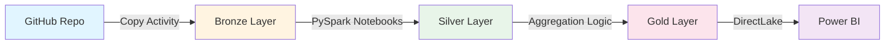

# 🛒 Fabric E-Commerce Analytics Pipeline

[](https://www.microsoft.com/en-us/microsoft-fabric)
[](https://spark.apache.org/)
[](https://powerbi.microsoft.com/)
[](https://www.python.org/)

> **End-to-end data engineering solution** leveraging Microsoft Fabric to transform raw e-commerce data into actionable business intelligence through a modern medallion architecture.

---

## 📊 Project Overview

This project demonstrates a **production-ready data pipeline** that ingests, transforms, and analyzes multi-source e-commerce data using Microsoft Fabric's unified analytics platform. The solution implements industry best practices including medallion architecture, incremental processing, and dimensional modeling.

### Business Impact
- **360° Customer View**: Unified customer profiles across orders, reviews, social media, and web behavior
- **Revenue Intelligence**: Real-time KPIs tracking $783K+ in transactions across 3,000+ orders
- **Predictive Insights**: RFM segmentation, sentiment analysis, and behavioral patterns for targeted marketing
- **Operational Excellence**: Automated ETL with data quality checks and lineage tracking

---

## 🏗️ Architecture

### Medallion Data Lakehouse Pattern

```
┌─────────────────┐      ┌─────────────────┐      ┌─────────────────┐
│  Bronze Layer   │─────▶│  Silver Layer   │─────▶│   Gold Layer    │
│   (Raw Data)    │      │  (Cleansed)     │      │  (Aggregated)   │
└─────────────────┘      └─────────────────┘      └─────────────────┘
        │                         │                         │
        ▼                         ▼                         ▼
  GitHub Ingestion        PySpark Transform          Delta Tables
  CSV/JSON Files          Schema Enforcement         Business KPIs
  Metadata-Driven         Data Validation            Power BI Reports
```

### Data Flow Pipeline


Workflow: 

---

## 🎯 Key Features

### 🔹 Data Engineering Excellence
- **Metadata-Driven Ingestion**: JSON-configured pipelines for scalable source management
- **Schema Evolution**: Automated type casting and validation across 35+ columns
- **Data Quality Framework**: Null handling, duplicate detection, and referential integrity checks
- **Incremental Processing**: Optimized with partition pruning and windowing functions

### 🔹 Advanced Transformations
- **Temporal Analytics**: Date hierarchies (year/month/quarter/weekday) for time-series analysis
- **Customer Segmentation**: RFM scoring, tenure buckets, and lifecycle classification
- **Product Intelligence**: Price quantiles, inventory valuation, and category grouping
- **Sentiment Scoring**: NLP-driven sentiment analysis across reviews and social media

### 🔹 Business Intelligence
- **20+ Gold KPIs**: Pre-aggregated metrics for instant dashboard performance
- **Multi-Dimensional Analysis**: Sales by product/customer/time/payment method
- **Behavioral Analytics**: Web funnel tracking (browsing → shopping → conversion)
- **Social Listening**: Platform-specific sentiment trends and content performance

---

## 📂 Project Structure

```
fabric-ecommerce-analytics/
│
├── 📁 silver/                      # Data cleansing & enrichment
│   └── silver_transformation.ipynb # PySpark transformations
│
├── 📁 gold/                        # Business aggregations
│   └── gold_transformation.ipynb   # KPI generation logic
│
├── 📄 structured_metadata.json     # CSV ingestion config
├── 📄 unstructured_metadata.json   # JSON ingestion config
└── 📄 README.md
```

---

## 🚀 Technical Implementation

### Bronze → Silver Transformation

**Challenge**: Inconsistent data types, missing values, and orphaned records from left joins.

**Solution**:
```python
# Schema standardization with enrichment
orders_enriched = orders_df \
    .withColumn("OrderDate", to_timestamp("OrderDate", "yyyy-MM-dd HH:mm:ss.SSSSSSSSS")) \
    .withColumn("Quantity", col("Quantity").cast("int")) \
    .join(customers, on="CustomerID", how="left") \
    .join(products, on="ProductID", how="left") \
    .withColumn("customer_missing", col("CustomerName").isNull()) \
    .withColumn("product_missing", col("ProductName").isNull())
```

### Silver → Gold Aggregation

**Challenge**: Dashboard performance with 3,000+ row scans per query.

**Solution**: Pre-computed KPIs stored as Delta tables
```python
# Revenue KPIs with window functions
kpis = orders.select(
    sum("TotalAmount").alias("TotalRevenue"),
    countDistinct("OrderID").alias("TotalOrders"),
    avg("TotalAmount").alias("AvgOrderValue")
)

# Write to Gold layer
kpis.write.mode("overwrite").saveAsTable("gold_revenue_kpis")
```

---

## 📈 Sample Insights Delivered

| Metric | Value | Business Impact |
|--------|-------|-----------------|
| **Total Revenue** | $783,914.86 | Executive KPI tracking |
| **Avg Order Value** | $261.30 | Pricing strategy optimization |
| **Repeat Customer Rate** | 100% | Loyalty program effectiveness |
| **Top Product Category** | Electronics | Inventory planning |
| **Peak Order Day** | Wednesday | Staffing optimization |
| **Payment Mix** | 34% Credit, 33% Debit, 33% PayPal | Fraud detection patterns |

---

## 🛠️ Technologies & Skills

### Microsoft Fabric Ecosystem
- **Data Factory**: Orchestration with Copy Activity and metadata-driven pipelines
- **Lakehouses**: Delta Lake storage with ACID transactions
- **Notebooks**: PySpark 3.4+ for distributed processing
- **Semantic Models**: DirectLake mode for real-time Power BI
- **Power BI**: Interactive dashboards with drill-through capabilities

### Data Engineering
- **PySpark SQL**: Complex joins, window functions, and UDFs
- **Delta Lake**: Time travel, schema enforcement, and Z-ordering
- **Data Modeling**: Star schema, slowly changing dimensions (SCD Type 2)
- **ETL Design**: Idempotent pipelines with error handling

### Analytics & Visualization
- **DAX**: Advanced calculations and measure optimization
- **Power Query M**: Custom transformations and parameter queries
- **KPI Design**: Actionable metrics aligned with business objectives

---

## 📊 Dashboard Preview

*Power BI reports deliver real-time insights across four key areas:*

### 1️⃣ Sales Performance
- Monthly revenue trends with YoY growth
- Product category breakdown
- Payment method distribution

### 2️⃣ Customer Analytics
- RFM segmentation heatmap
- Customer lifetime value (CLV) ranking
- Geographic revenue distribution

### 3️⃣ Engagement Metrics
- Web traffic patterns by hour/day
- User action funnel (view → cart → purchase)
- Social media sentiment analysis

### 4️⃣ Product Intelligence
- Top performers by revenue and units sold
- Inventory turnover rates
- Price elasticity analysis

---

## 🎓 Learning Outcomes

This project showcases proficiency in:

✅ **Modern Data Architecture**: Medallion pattern implementation at scale  
✅ **Cloud-Native Development**: Microsoft Fabric's unified SaaS platform  
✅ **Performance Optimization**: Query tuning, partitioning, and caching strategies  
✅ **Data Quality Engineering**: Validation frameworks and lineage tracking  
✅ **Business Acumen**: Translating technical solutions into stakeholder value  

---

## 🔮 Future Enhancements

- [ ] **CI/CD Integration**: GitHub Actions for automated notebook deployment
- [ ] **Machine Learning**: Churn prediction and recommendation engine
- [ ] **Streaming Data**: Real-time ingestion with Event Hubs
- [ ] **Data Governance**: Microsoft Purview for compliance and cataloging
- [ ] **Cost Optimization**: Capacity management and query optimization

---

## 📝 License

This project is available for portfolio review and educational purposes.

---

<div align="center">

**Built with ☕ and ⚡ by [Md.Bayzid Hossain]**

*Transforming data into decisions*

</div>
